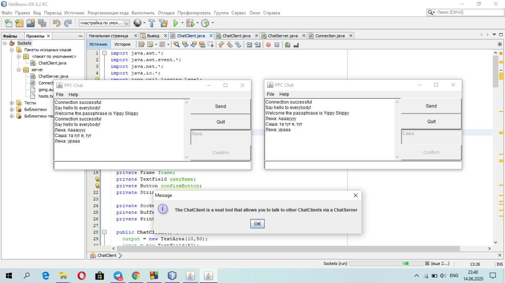

# Створення сокет-клієнта

Ця робота доповнює основний цикл лабораторних робіт #1-8 (проект **Banking**, [Netbeans](https://netbeans.org/)) з ООП на третьому курсі [ППК НТУ "ХПІ](http://polytechnic.poltava.ua)". Основна мета роботи - познайомитись з мережевими можливостями Java на прикладі сокетних комунікацій. Згадувані 'базові' роботи розміщено в [окремому репозиторії](https://github.com/liketaurus/OOP-JAVA).

## Хід роботи
### Допрацювання чат-клієнту
* завдання на 5
## Результата

